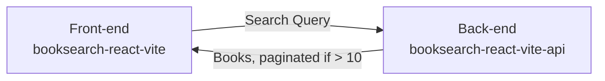

# booksearch-react-vite-api

Very basic book search API built with Express + TypeScript.
Acts as a proxy API to [Google Books API](https://developers.google.com/books/docs/v1/using) and uses [booksearch-react-vite](https://github.com/nunogois/booksearch-react-vite) as the front-end.

Since I prefer a microservice and decoupled approached compared to setting up monorepos, as always I decided to separate the front-end and back-end in different repos.

## Developer Log

I followed a [YAGNI](https://en.wikipedia.org/wiki/You_aren%27t_gonna_need_it) and [lean](https://en.wikipedia.org/wiki/Lean_software_development) approach as much as possible.

The main entrypoint and file for this API will be `index.ts`, however the endpoints and respective logic can be found in `router.ts`. Since this is the main file where our logic happens, it is test covered by `router.test.ts`.

Also added a very simple in-memory cache layer to the /books endpoint, using a map where the key is the URL being requested. This way we don't make unnecessary requests to the Google Books API and we get an immediate response back from repeated requests.

Added a lot of comments to the code to explain my thought process.

## Known Bugs

It seems like there's an issue with the totalItems property in the response from the Google Books API: https://stackoverflow.com/questions/7266838/google-books-api-returns-json-with-a-seemingly-wrong-totalitem-value - It returns seemingly random results for each page. Because of that, pagination might break at any moment. That's one of the reasons I limited pagination to 10 pages max.

## Getting Started

1. Clone the repo: `git clone https://github.com/nunogois/booksearch-react-vite-api.git`;
2. cd into the folder: `cd booksearch-react-vite-api`;
3. Install dependencies: `yarn` or `npm install`;
4. Run tests: `yarn test` or `npm run test`;
5. Run the server: `yarn start` or `npm run start`;

Check out [booksearch-react-vite](https://github.com/nunogois/booksearch-react-vite) and follow its instructions to run the front-end, so you can run everything together locally.
