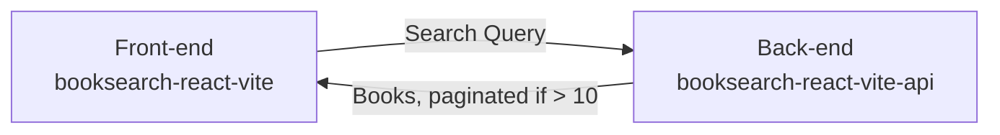

# booksearch-react-vite-api

Very simple Node.js API for book search built with Express + TypeScript.

Acts as a proxy API to [Google Books API](https://developers.google.com/books/docs/v1/using).

Currently hosted on my Oracle Cloud ARM VM instance: https://booksearch-react-vite-api.nunogois.com

Uses [booksearch-react-vite](https://github.com/nunogois/booksearch-react-vite) as the front-end.

Since I prefer a microservice and decoupled approached compared to setting up monorepos, as always I decided to separate the front-end and back-end in different repos. Who knows, maybe this API will be consumed by other front-end apps in the future, so it should live independently.

## Getting Started

1. Clone the repo: `git clone https://github.com/nunogois/booksearch-react-vite-api.git`;
2. cd into the folder: `cd booksearch-react-vite-api`;
3. Install dependencies: `yarn` or `npm install`;
4. Run tests: `yarn test` or `npm run test`;
5. Run the server: `yarn start` or `npm run start`;

Check out [booksearch-react-vite](https://github.com/nunogois/booksearch-react-vite) and follow its instructions to run the front-end, so you can run everything together locally.

## Developer Log

I followed a [YAGNI](https://en.wikipedia.org/wiki/You_aren%27t_gonna_need_it) and [lean](https://en.wikipedia.org/wiki/Lean_software_development) approach as much as possible.

The main entrypoint and file for this API will be `index.ts`, however the endpoints and respective logic can be found in `router.ts`. Since this is the main file where our logic happens, it is test covered by `router.test.ts`.

Added a very simple in-memory cache layer to the `/books` endpoint, using a map where the key is the URL being requested. This way we don't make unnecessary requests to the Google Books API and we get an immediate response back from repeated requests.

Also added some comments to the code, even though most are redundant, since the code is pretty self-explanatory.

## Filtering by Star Rating

The original idea was to filter books by the star rating. However, this filtering option is not supported by the Google Books API, so I tried to use the supported filtering options instead: https://developers.google.com/books/docs/v1/using#filtering

I could of course also retrieve a large amount of results and do the filtering by star rating on the front-end after having that information for all results, but that doesn't seem like the best idea for the aim of the project, given that we are also using server-side pagination.

We could also retrieve the top 100 books for our search query, for example in 5 requests of 20 books each, and then filter the results by star rating, but that seems overkill for the current scope.

A long term solution for this could probably involve having a crawl process running on the background, which would retrieve all (or relevant) books from the Google Books API and store them in a database, for example, where we could then have full control.

However, like I said, this falls out of the scope for such a small project.

## Known Bugs

It seems like there's an issue with the totalItems property in the response from the Google Books API: https://stackoverflow.com/questions/7266838/google-books-api-returns-json-with-a-seemingly-wrong-totalitem-value - It returns seemingly random results. Because of that, pagination might break at any moment. That's one of the reasons I limited pagination to 10 pages max.
